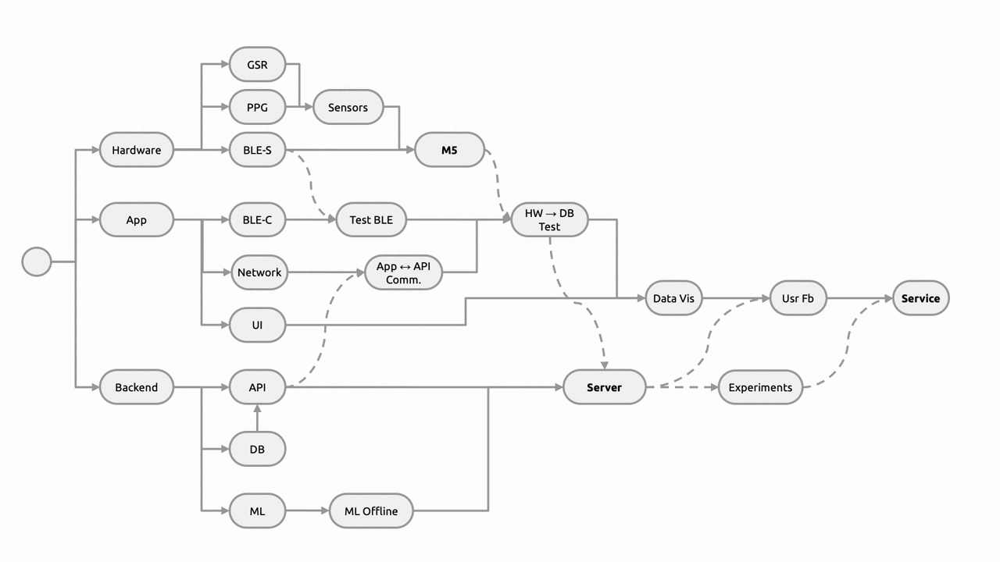

<h1 align="center">
	
  <br>
  Mobile Healthcare and Machine Learning
</h1>

<p  align="center">
<sup>
  <a href="https://github.com/mohyaboualam">Mohyeldin Aboualam</a>, 
  <a href="https://github.com/Scott-Bunting">Scott Bunting</a>, 
  <a href="https://github.com/fc2115">Felix Crowther</a>, 
  <a href="https://github.com/nebbles">Benedict Greenberg</a>, 
  <a href="https://github.com/josephine-latreille">Josephine Latreille</a>, 
  <a href="https://github.com/caoanle13">Cao An Le</a>, 
  <a href="https://github.com/leahpattison">Leah Pattison</a>
</sup>
</p>

<p  align="center">
<sup><sup>
  Department of Electrical and Electronic Engineering & Dyson School of Design Engineering, Imperial College London
</sup></sup>
</p>

<!-- <h4 align="center">
  <a href="#">More information coming soon...</a>
  <br><br>
  
</h4> -->

<!-- 
<p align="center">
	<sub>Design Engineering, Imperial College London</sub>
</p>
<br>
<p align="center">
	<a href="https://vimeo.com/291377091" >
	</a>
</h1>
<br>
-->

**Sensa** is a mobile healthcare monitoring system which aims to use a blend of self reported measures and physiological signal analysis to detect stress and guide users to improve their state using personalised exercises.

### Repository Structure 

*Note: This is a 'light' version of the project structure. For more information on files, refer to the relevant subdirectory README.*

```
MHML/
  ├─ .github/                     GitHub configuration files
  ├─ docs/API_Specification.md    Documentation on API usage
  ├─ docs/BLE_Specification.md    Documentation on BLE configuration and usage
  ├─ docs/Data_Specification.md   Documentation on cross platform data usage
  │
  ├─ app/                         Unity app development is stored
  │
  ├─ hardware/                    Firmware development for M5Stack Fire            
  │    ├─ lib/                    Custom and 3rd party libraries
  │    ├─ src/ble.h               BLE server logic
  │    ├─ src/data.h              Definition of central data structure
  │    ├─ src/gsr.h               GSR sensor development
  │    ├─ src/main.cpp            Main firmware runtime
  │    ├─ src/ppg.h               PPG sensor development
  │    └─ README.md               Hardware specific readme
  │
  ├─ server/
  │    ├─ api/                    Flask application for server API
  │    ├─ ml/                     Development of machine learning models
  │    └─ main.py     
  │
  ├─ LICENSE
  └─ README.md
```

### System Overview

<p align="center"></p>

### Project Development

From the early stages of the project, we anticipated how the division of development should operate in order to maximise our modularity and reduce interdependencies. This made integration at the later stages far more efficient. See below for a simple graphic of the process.

<p align="center"></p>

